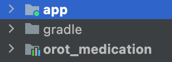
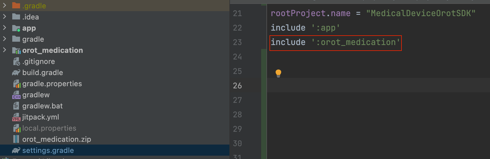

### 의료장비에서 측정된 데이터를 OrotCode 서버로 보내는 Module 입니다.  


-------
##### 이번 데모 프로세스는 아래와 같습니다.
- 필요한 장비
  - 오롯코드 개발: 헬스케어(스마트미러 태블릿 앱)
  - 오롯코드 개발: 갤럭시 워치 5 ( 혈압, 심박수 측정)
  - 손박사님 개발: 의료장비 ( 혈압, 혈당 측정 )

1. 각 디바이스(워치 5, 의료장비) 에서는 스마트미러가 측정화면까지 도달하기 전에 미리 서버에 연결을 한다.
2. 스마트미러 앱에서 기존 앱을 실행해서 의료데이터 측정 화면까지 진행한다.
3. 스마트미러 앱에서 의료데이터 측정화면으로 가면 각 디바이스(워치 5, 의료장비)로 측정을 시작하라는 메세지가 전송된다.
4. 각 디바이스(워치 5, 의료장비)에서는 서버로 부터 측정알림을 수신하고, 측정한 데이터를 서버로 응답해준다.
5. 스마트미러 앱에서 각 디바이스로 부터 측정 데이터를 전달받아, 이후 프로세스를 진행한다.


-----
-----

#### Module 기능 설명
* connectServer() - 오롯코드 서버에 연결 요청을 한다. ( 웹 소켓 기반 )  


* closeServer() - 오롯코드 서버에 연결을 해제한다.   


* setListener(MedicationStateListener listener) - 오롯코드 서버의 상태를 알기 위해 리스너를 설정한다. ( 측정 메세지도 여기서 수신가능 )  


* sendMedicalInfo() - 디바이스에서 측정한 의료 데이터를 오롯코드 서버로 전달한다.


-----
-----
### 사용방법
1. 다음과 같이 전달받은 orot_medication 폴더를 app path와 같은 위치에 넣는다.




2. root - setting.gradle에 orot-medication 모듈을 등록한다.  
   ( 모듈을 등록하게되면, 폴더 아이콘이 모듈형태의 아이콘 처럼 변경됩니다. )  



3. 이제 모듈에 있는 기능을 사용 할 수 있습니다.
     

4. 샘플 예제
```
  1. (필수) // 오롯코드 SDK 객체를 생성한다.
  OrotMedicationSDK sdk = new OrotMedicationSDK(); 
  
  2. (필수) // 오롯코드 SDK에 리스너를 등록한다.
  sdk.setListener(new MedicationStateListener() {
      @Override
      public void onState(@NonNull State state, @Nullable String msg) {
          Log.w("onState", "onState: " + state + " || msg:" + msg );
          switch (state){
          
              // 아무것도 하지 않은 초기 상태
              case IDLE: { 
                  break;
              }
              
              // 서버에 연결 시 호출 ( 웹 소켓 기반 )
              case CONNECTED: { 
                  break;
              }
              
              // 서버나 웹 소켓쪽에서 에러가 발생했을때 호출
              case ERROR:{ 
                  Log.e("onState", "error msg:" + msg );
                  break;
              }
              
              // 서버에 연결이 해제 되었을때 호출
              case CLOSED:{ 
                  break;
              }
              
              // 디바이스에서 측정한 의료데이터를 서버에 보내라는 신호
              case ALLOWED_TRANSMISSION:{ 
                  sdk.sendMedicalInfo(120, 100); // (Int 수축기 혈압, Int 공복 혈당) 값 입니다.
                  break;
              }
          }
  
      }
  });
  
  3. (필수) // 서버에 연결을 시도한다.
  sdk.connectServer(); 
  
  4. (옵션) // 서버와 연결을 해제한다.
  sdk.closeServer(); 

```

